# GameStore

A game storefront web app with a customer-facing shop and a separate admin portal. It is the
React + TypeScript frontend for a Spring Boot + JWT API,
[`gameStore-backend`](https://github.com/Robotbino/gameStore-backend).

It demonstrates a complete commerce loop, **discover → wishlist → cart → checkout → own**, with
simulated payments, a points economy, and self-service accounts. The architecture behind it is
documented as a first-class deliverable.

[](https://react.dev/)
[](https://www.typescriptlang.org/)
[](https://vite.dev/)
[](https://reactrouter.com/)
[](https://github.com/Robotbino/gameStore-backend)

> **Live demo:** _coming soon_ · **Backend repo:** [`Robotbino/gameStore-backend`](https://github.com/Robotbino/gameStore-backend) · **Docs:** [Handbook hub](docs/index.html) · [Architecture](docs/architecture.html) · [Catalog pivot](docs/catalog-architecture.html) · [Roadmap](docs/frontend-roadmap.html)

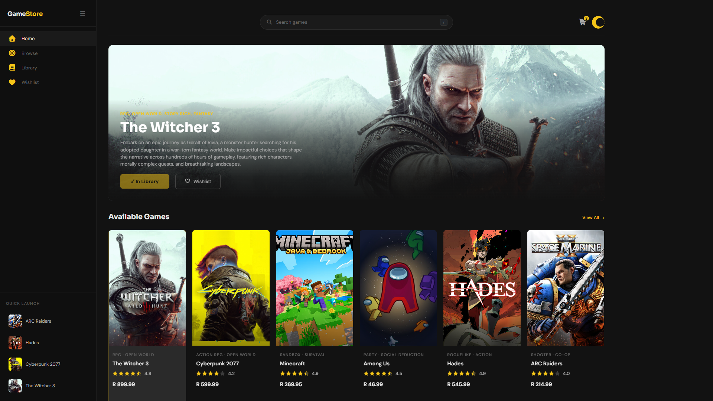

---

## Contents

- [Screenshots](#screenshots)
- [Features](#features)
- [Tech stack](#tech-stack)
- [Getting started](#getting-started)
- [Project structure](#project-structure)
- [Routes](#routes)
- [How it talks to the API](#how-it-talks-to-the-api)
- [Architecture notes](#architecture-notes)
- [Documentation](#documentation)
- [Known limitations](#known-limitations)

---

## Screenshots

### Store

| | |
|---|---|
| 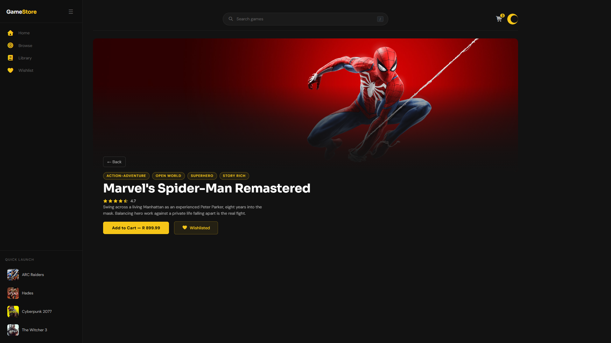 | 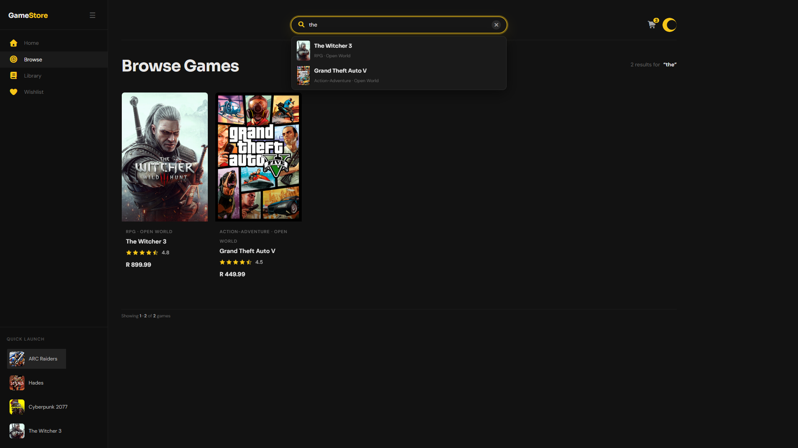 |
| **Game details**: hero art, genre chips parsed from the comma-separated `genre` column, rating, add to cart, and the wishlist toggle | **Search**: one navbar box, debounced, with live suggestions as a keyboard-navigable combobox |
| 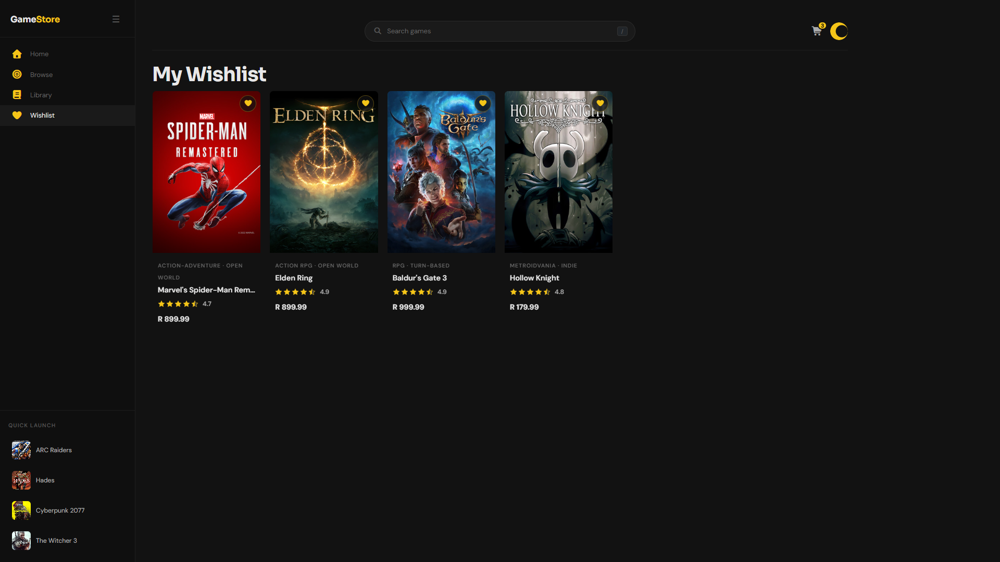 | 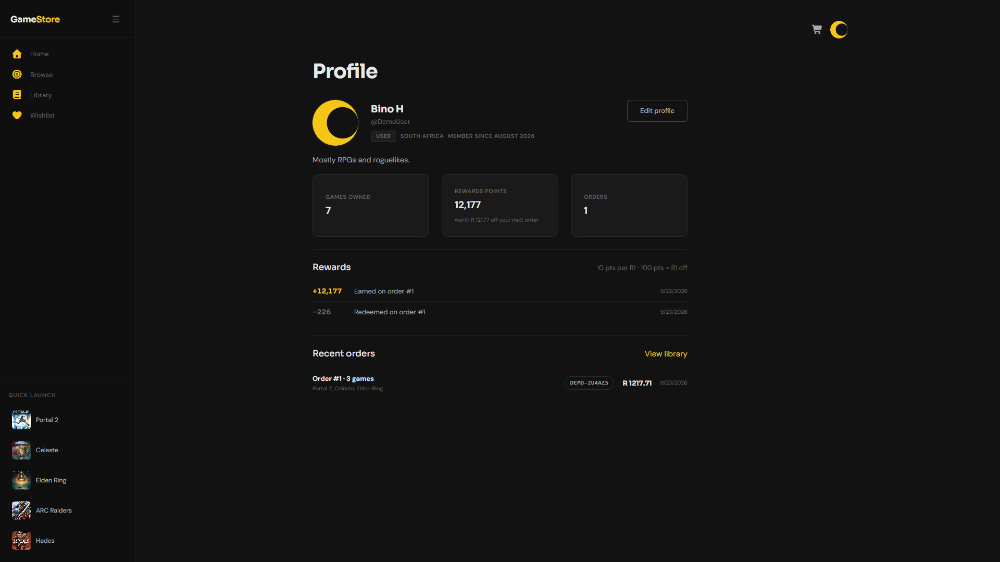 |
| **Wishlist**: hearts on the hero, the details page, and every card, toggled optimistically | **Profile**: identity, stats, the points ledger, and recent orders with their `DEMO-` references |

### Checkout and rewards

| | |
|---|---|
| 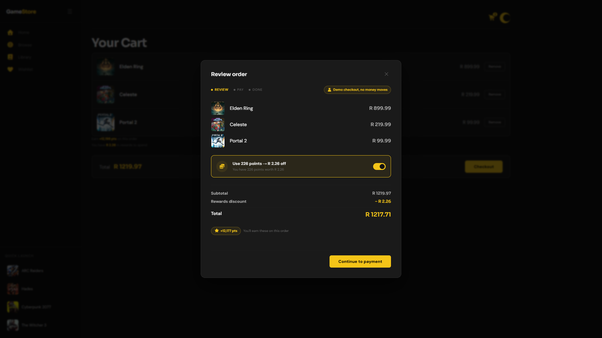 | 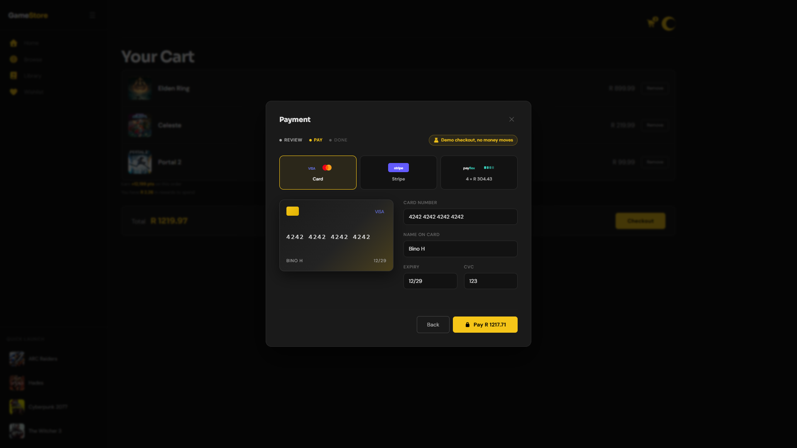 |
| **Review**: redeem points against the order and preview the points you'll earn | **Pay**: Card / Stripe / Payflex under a visible *"Demo checkout, no money moves"* badge |

### Account and sign-in

| | |
|---|---|
| 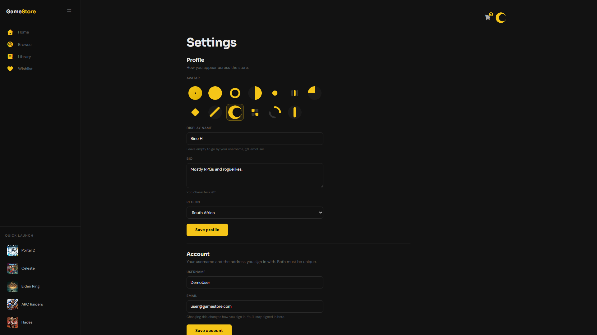 | 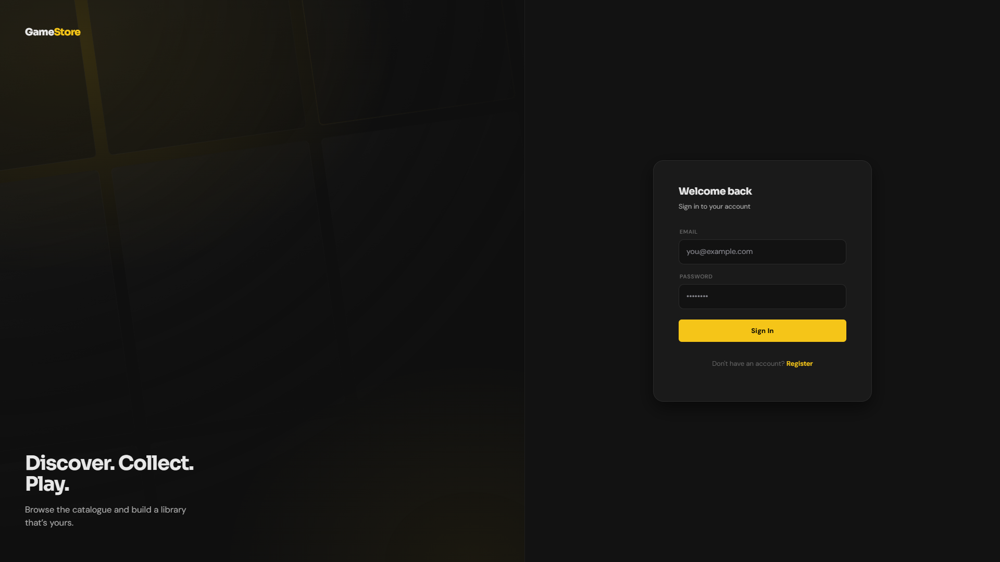 |
| **Settings**: three independent forms for profile, account, and password | **Sign in**: one login for both roles; admins land in the portal |

### Admin portal

| | |
|---|---|
| 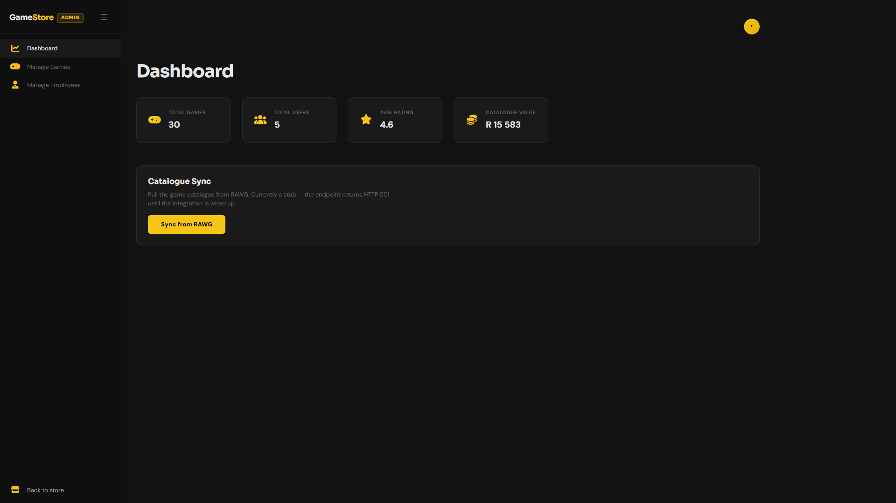 | 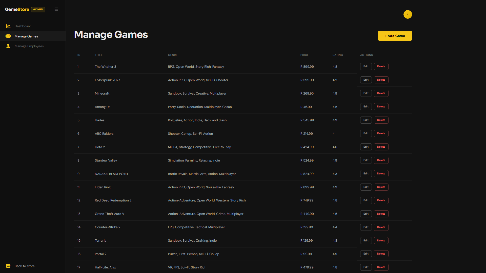 |
| **Dashboard**: catalogue and user stats, plus the RAWG sync stub | **Manage games**: full CRUD, server-side paginated |
| 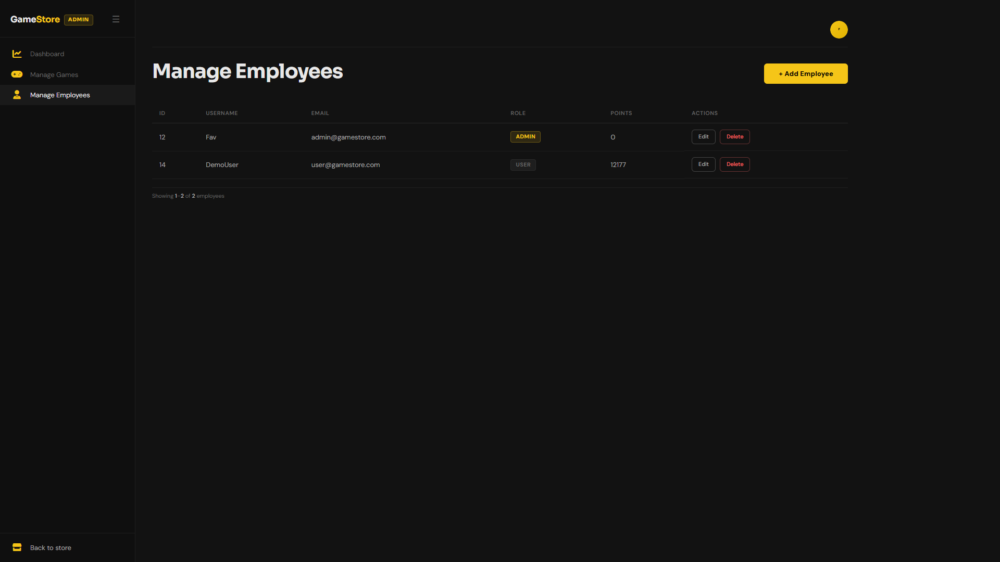 | |
| **Manage users**: role badges and points. Passwords never leave the server; the API's `UserResponse` has no hash field. | |

<sub>Captured at 1920×1080 against a local backend, signed in as the seeded demo account. The admin
users table is limited to the demo accounts.</sub>

---

## Features

### Store (any signed-in user)

- **Home**: a featured hero above a 12-game showcase, with **View All →** linking to Browse when
  there are more. Clicking a card swaps it into the hero.
- **Browse**: the full catalogue, 12 per page, server-side paginated. Changing page adds a history
  entry and scrolls to the top. The hero steps aside while a search term is active, so results start
  at the top.
- **Search**: one centred navbar box, shown only on the store's browsing routes (`/`, `/browse`,
  `/games/:id`, `/library`, `/wishlist`).
  - Debounced 300 ms against the server-side `GET /games/all?q=` (title only, case-insensitive).
  - Up to six live suggestions in a keyboard-navigable combobox.
  - On `/browse`, the box and the URL (`?q=&page=`) stay in sync using history *replace*. Elsewhere,
    submitting navigates to `/browse?q=…`.
  - `/` focuses the box from anywhere except while you're typing in a field. Escape clears it.
- **Game details**: full-bleed hero art, genre chips, a half-star rating, add to cart, and a wishlist heart.
- **Wishlist**: a heart on the hero, the details page, and every card, backed by `GET /wishlist/me` and
  `POST`/`DELETE /wishlist/{gameId}`. Toggles are optimistic and roll back on failure, and a second
  click while a request is in flight is ignored. The `/wishlist` page lists what you saved.
- **Library**: every game you own, resolved from the token (never from a URL param). On the hero and
  the details page, owned games show **✓ In Library** instead of a buy button.
- **Quick Launch**: the sidebar strip shows up to five games you own.
  - On `/browse` it cycles every 8 s and hands the hero to whichever game is showing.
  - Clicking a grid card pauses it; after 60 s idle it restarts from the first game.
  - Clicking a strip row opens that game.

### Cart, checkout, and rewards

- **Cart**: stored per account in `localStorage` (`cart:<email>`), so switching users never inherits
  someone else's cart and a refresh keeps it. Adding is idempotent, and the navbar badge caps at `99+`.
- **Checkout modal**: *review → pay → processing → success*, with a progress strip reading Review /
  Pay / Done.
  - **Payment options:** Card (with a live card preview), Stripe, and Payflex (shown as four
    instalments). The Stripe and Payflex options explain the redirect they'd do, and the demo
    completes it for you.
  - **Card form:** requires 16 digits, `MM/YY`, and a 3-digit CVC. A number ending in `0002` is
    declined locally, so the failure path can be demoed.
  - **Processing:** takes at least 1.2 s, and the modal can't be dismissed during it.
  - **What's sent:** card details **never leave the browser**. The request carries only `gameIds`,
    `paymentMethod`, and `redeemPoints`. `POST /orders/checkout` snapshots each line's title and
    price and returns a `DEMO-` reference.
- **Rewards**: a simulated points balance.
  - Earn 10 points per R1 of an order's final total.
  - Redeem at checkout at 100 points = R1 off, capped at the subtotal. The toggle is all-or-nothing
    and unlocks at 100 points.
  - The cart previews the points you'll earn. The success step shows the amount paid, the points
    earned, and your new balance.

### Account

- **Avatar menu**: name, role badge, Profile, Settings, and Log out. It closes on an outside click
  or Escape.
- **`/profile`**: display name, `@handle`, role, region, and join month; the bio (or a prompt to add
  one); stat tiles for games owned, points (with their Rand worth), and orders; and the last five
  ledger entries and last five orders.
- **`/settings`**: three independent forms that save separately.
  - **Profile:** one of twelve code-drawn avatar presets or your initial, a display name (≤ 50), a
    bio (≤ 280, with a live counter), and a region (ISO country codes named by the browser's `Intl`).
  - **Account:** username and email. Changing the email swaps in the fresh token the API returns,
    so you stay signed in.
  - **Password:** current password, a new one (≥ 8), and a confirmation checked in the browser only.

### Admin portal (role `ADMIN`)

- **Layout**: a separate `AdminLayout` behind an `AdminRoute` guard. The nav has Dashboard / Manage
  Games / Manage Employees and "Back to store". Admins can use the whole store too; the store
  sidebar shows them an **Admin console** link.
- **Dashboard**: stat cards for total games, total users, average rating, and catalogue value.
  Totals are exact; the average and value are computed from the first 200 games, with a note when
  the catalogue is bigger. A **Sync from RAWG** button reports the stub's HTTP status and message.
- **Manage games**: 20 rows per page. The add/edit modal takes title, comma-separated genres,
  price, rating (0–5), description, cover URL, and hero URL. Adding jumps to the last page, and
  delete asks for inline confirmation.
- **Manage users**: 20 rows per page with role badges and points. Edit changes username, email,
  role, and points; a password field appears only when creating a user. Delete asks for inline
  confirmation.

### Cross-cutting

- Register and sign in with JWT. The role comes from the token's `role` claim. Login sends admins to
  `/admin` and users to `/`, and registering signs you straight in.
- Expired or unreadable tokens are rejected when the app loads, so a stale session starts signed out
  instead of half-working.
- One axios instance attaches `Authorization` to every request. On a `401` from anything but the
  auth endpoints, it clears the token and sends you to `/login`.
- A 60-second read-through cache over the catalogue, invalidated by every admin game mutation.
- A motion system on one token ladder (`--duration-*`, `--ease-*`): route enter transitions,
  staggered card arrival, a two-layer hero crossfade, and press and focus feedback on every control.
  `prefers-reduced-motion` collapses all of it.
- Skeleton loaders on Home, Browse, Library, and Wishlist. A shared `Modal` with enter/exit motion,
  Escape handling, and a focus trap is used by the admin forms and checkout.
- Friendly API errors (`utils/apiError.ts`). Field-level validation messages come first, then the
  server's `message`. A request that never got a response explains the likely cause: API not on
  `:8181`, or the page not on `:5173`.
- A role-aware 404 page. Its button goes to `/admin`, `/`, or `/login` depending on who you are.
- A public RBAC demo at `/demo` (see [Routes](#routes)).

---

## Tech stack

| Layer | Choice |
|---|---|
| UI | React 19 + TypeScript 5.9 (strict) |
| Build | Vite 7 via `rolldown-vite` 7.1.14, pinned with an npm `overrides` entry |
| Routing | React Router 7: nested layout routes plus `ProtectedRoute` / `AdminRoute` guards |
| Styling | Hand-written CSS design system: tokens and components in `src/App.css`, checkout in `src/styles/checkout.css`, and one import hub in `src/styles/index.css` |
| Icons | Font Awesome Free 7 (CSS classes) |
| Legacy UI libs | Bootstrap 5 CSS + JS bundle, still loaded globally. Chakra UI 3's provider is mounted (dark mode forced via `next-themes`), but no Chakra components render. Consolidating onto one system is an open roadmap item. |
| HTTP | Axios, one instance with request/response interceptors for JWT |
| Auth | `jwt-decode`, with the token in `localStorage` |
| Fonts | Sora (display) + DM Sans (body), self-hosted via Fontsource variable fonts |
| Tooling | ESLint 9 (flat config, `typescript-eslint`, React Hooks rules) and Prettier 3 |

The visual system, a single-accent gold (`#F5C518`) on near-black dark theme, is specified in
[`DESIGN.md`](DESIGN.md). The product's audiences, constraints, and explicitly undecided questions are
in [`PRODUCT.md`](PRODUCT.md).

---

## Getting started

### Prerequisites

- **Node.js `^20.19` or `≥ 22.12`** and npm. These are rolldown-vite 7's engine range; older Node 20
  releases fail at `npm run dev`.
- **The API** from [`gameStore-backend`](https://github.com/Robotbino/gameStore-backend) running on
  `http://localhost:8181`. Without it the app still renders, but every data call fails. Its
  [Quick start](https://github.com/Robotbino/gameStore-backend#quick-start) covers MySQL, the two
  secrets, and adding games to the (initially empty) catalogue.

### Run the full stack

```bash
# 1. Clone both repos side by side (the docs cross-links expect this layout)
git clone https://github.com/Robotbino/gameStore-backend.git
git clone https://github.com/Robotbino/gameStore.git

# 2. Start the API. See the backend README for DB_PASSWORD / JWT_SECRET
cd gameStore-backend && ./mvnw spring-boot:run

# 3. In a second terminal, start this app
cd gameStore && npm ci && npm run dev
```

Open **http://localhost:5173**.

The dev server is pinned to port 5173 with `strictPort: true`. The API's CORS policy allows exactly
`http://localhost:5173`, and Vite's default behaviour on a busy port is to slide to 5174. The app would
still load there, but every API call would fail CORS and look like a dead server. With `strictPort`,
Vite fails loudly at startup instead.

### Accounts

| Account | Where it comes from |
|---|---|
| `user@gamestore.com` / `12345678` | Seeded by the API on first boot (`USER`) |
| `admin@gamestore.com` + a password you choose | **Register it yourself** at `/register`. The API grants `ADMIN` to that address. The API's startup log and the `/demo` page both claim an admin with password `12345678` is seeded; it isn't (backend roadmap B3). |

### Configuration

```bash
cp .env.example .env.local
```

| Variable | Default | Notes |
|---|---|---|
| `VITE_API_URL` | `http://localhost:8181` | Base URL of the Spring Boot API |

> ⚠️ Vite inlines `VITE_*` variables at **build** time, not runtime. A deployed bundle has the value
> baked in, so it must be set before `npm run build`; setting it as an env var on the host does
> nothing. Only put non-secrets here. Everything in `.env.local` ships to the browser.

### Scripts

```bash
npm run dev           # dev server with HMR on :5173
npm run build         # tsc -b (typecheck) + production build into dist/
npm run preview       # serve the production build locally
npm run lint          # eslint .
npm run format        # prettier --write .
npm run format:check  # prettier --check .
```

There is no test runner yet; see [Known limitations](#known-limitations).

---

## Project structure

```
src/
├── main.tsx            # Entry: providers (Chakra, color mode), router, global CSS
├── App.tsx             # Auth → Cart → Wishlist providers around AppRoutes
├── App.css             # The design system: tokens, components, motion, breakpoints
├── assets/             # Template leftovers (unused)
├── components/
│   ├── account/        # AvatarMark, AvatarPicker, avatarPresets (12 code-drawn marks)
│   ├── auth/           # AuthShell (the two-panel login/register frame)
│   ├── checkout/       # CheckoutModal (review → pay → processing → success)
│   ├── game/           # GameGrid, GameGridSkeleton, HeroSection
│   ├── layout/         # AppLayout (store), AdminLayout (portal), PageTransition
│   ├── payment/        # PaymentMarks (inline Visa/Mastercard/Stripe/Payflex marks)
│   ├── search/         # SearchBar, SearchSuggestions
│   ├── ui/             # Chakra color-mode plumbing
│   └── *.tsx           # Navbar, SideBar, GameCard, WishlistButton, Modal, Pagination,
│                       #   StarRating, UserAvatar (account menu), LoadingScreen
├── context/            # AuthContext, CartContext, WishlistProvider + wishlist.ts,
│                       #   QuickLaunchProvider + quickLaunch.ts (constants and context objects)
├── hooks/              # useAuth, useCart, useWishlist, useOrders, useRewards, usePurchases,
│                       #   useGameSuggestions, useQuickLaunch
├── pages/
│   ├── account/        # ProfilePage, SettingsPage
│   ├── admin/          # AdminDashBoard, ManageGamesPage, ManageUsersPage
│   ├── auth/           # LoginPage, RegisterPage
│   ├── user/           # HomePage, BrowsePage, GameDetailsPage, CartPage, LibraryPage, WishlistPage
│   ├── DemoPage.tsx    # Public RBAC demo
│   └── NotFoundPage.tsx
├── routes/             # AppRoutes, ProtectedRoute, AdminRoute, searchableRoutes (navbar-search allowlist)
├── services/           # The axios layer: api (instance + interceptors), auth, game, user,
│                       #   purchase, order, rewards, wishlist
├── styles/             # index.css (single CSS entry: fonts → App.css → checkout.css), checkout.css
├── types/              # Game, User, Purchase, Order, Rewards, Wishlist, auth, pagination
└── utils/              # apiError, genre parsing, country codes, rewards maths

docs/                   # The engineering handbook (see Documentation) + screenshots/
DESIGN.md · PRODUCT.md  # Design system spec and product brief
```

---

## Routes

| Path | Access | Page |
|---|---|---|
| `/login` | Public | Sign in. If already signed in, admins go to `/admin` and users to `/`. |
| `/register` | Public | Create an account. If already signed in, redirects to `/`. |
| `/demo` | Public | RBAC demo, no layout (see below) |
| `/` | Signed in | Home |
| `/browse` | Signed in | Browse + search |
| `/games/:id` | Signed in | Game details |
| `/cart` | Signed in | Cart & checkout |
| `/library` | Signed in | Owned games |
| `/wishlist` | Signed in | Saved games |
| `/profile` | Signed in | Profile (from the avatar menu) |
| `/settings` | Signed in | Settings (from the avatar menu) |
| `/admin` | `ADMIN` | Dashboard |
| `/admin/games` | `ADMIN` | Manage games |
| `/admin/users` | `ADMIN` | Manage users ("Manage Employees") |
| `/admin/login` | — | Legacy redirect to `/login` |
| `*` | — | 404, shown deliberately rather than silently bouncing home |

Store routes check only that you're signed in, so admins can shop too. Signed-out visitors are sent
to `/login`. A non-admin who opens `/admin/*` is sent to `/`.

**`/demo`** is a standalone page that isn't linked from the app. For four endpoints it shows the
expected status for anonymous / `USER` / `ADMIN` callers (the `401 → 403 → 200/501` ladder) and lets
you fire each call with whatever token you currently hold. It uses its own bare axios client, so the
interceptors don't redirect you mid-demo.

---

## How it talks to the API

Every call goes through `services/`, and every service uses the one axios instance in `services/api.ts`.
The full contract is in the backend's
[API reference](https://github.com/Robotbino/gameStore-backend#api-reference).

| Service | Calls |
|---|---|
| `authService` | `POST /api/v2/auth/authenticate` · `POST /api/v2/auth/register` |
| `gameService` | `GET /games/all` (`q`, `genre`, `page`, `size`, `sort`) · `GET /games/find/{id}` · `POST /games/add` · `PUT /games/{id}` · `DELETE /games/{id}` · `POST /games/sync/rawg` |
| `userService` | `GET /users/me` · `PUT /users/me/profile` · `PUT /users/me/account` · `PUT /users/me/password` · `GET /users/all` · `POST /users/add` · `PUT /users/{id}` · `DELETE /users/{id}` |
| `purchaseService` | `GET /purchases/me` (the library) · `POST /purchases` (legacy; unused since checkout moved to orders) |
| `orderService` | `POST /orders/checkout` · `GET /orders/me` · `GET /orders/{id}` (not used by a page yet) |
| `rewardsService` | `GET /rewards/me` |
| `wishlistService` | `GET /wishlist/me` · `POST /wishlist/{gameId}` · `DELETE /wishlist/{gameId}` |

---

## Architecture notes

These are decisions worth knowing before you read the code. The full reasoning lives in
[`docs/architecture.html`](docs/architecture.html).

**Auth lives in one place.** `services/api.ts` owns the single axios instance. The request
interceptor attaches the bearer token. The response interceptor handles `401` by clearing the token
and doing a full-page redirect to `/login`, but it skips any URL containing `/auth/`. That way a
wrong password on `/api/v2/auth/authenticate` shows an error on the login form instead of reloading
it. No other service holds auth logic.

**The token is the identity.** `GET /users/me`, `/purchases/me`, `/orders/me`, `/wishlist/me` and
`/rewards/me` take no id parameter; the server resolves the caller from the JWT. `applyToken()`
throws rather than returning a role it never applied. An earlier version that did return one let a
failed register look like a success. If `GET /users/me` fails right after sign-in, the session is
torn down rather than left half-authenticated.

**Changing your email re-issues your token.** A JWT's subject is the email, and the backend resolves
the caller by looking that subject up. So `PUT /users/me/account` returns a freshly minted token
alongside the updated record, and `AuthContext.applyNewToken` swaps it in. Without that, the next
request after an email change would arrive anonymous, and the 401 interceptor would bounce you to
`/login` mid-save. For the same interceptor reason, a wrong *current* password on the password form
comes back as `400`, not `401`: a typo must not read as a dead session.

**The catalogue is cached, searches aren't.** `gameService` keeps a 60-second read-through cache
keyed by the full query string. It holds at most 20 pages with FIFO eviction, plus a by-id map
primed from every page fetch. Keyword searches are excluded: they're already debounced and every
keystroke is a distinct key, so caching them would grow the map without ever scoring a hit. Every game
create, update, or delete clears both caches. The cache is in memory and per tab, and the by-id map
has no TTL of its own.

**The backend contract is mirrored, not corrected.** `GET /games/find/{id}`, `POST /games/add` and
`POST /users/add` aren't REST-conventional, but they're what the backend serves today. The service
layer documents this rather than "fixing" it unilaterally. Likewise, `Game.genre` is one
comma-separated column (`"RPG, Open World, Fantasy"`), not an array. `parseGenres()` in
`utils/genre.ts` is the single seam that turns it into chips; cards and suggestions show the first two.

**Prices and payment are simulated.** Display currency is South African Rand (`R 899.99`). There is
no payment provider and none is planned. The checkout modal's provider marks and card preview are
visual cues under a visible demo badge. `POST /orders/checkout` grants server-side ownership,
snapshots each line's title and price, and returns a `DEMO-` reference. Nothing else happens.

**Rewards maths lives in one file, and the server always recomputes.** `utils/rewards.ts` mirrors the
backend's `RewardsService` constants (10 points earned per R1, 100 points per R1 off, and the same
round-down-to-the-cent rules), so the cart and checkout preview show the numbers the server will
return. The frontend never trusts its own arithmetic: the order response carries the authoritative
`pointsEarned`, `discount`, and `pointsBalance`.

**The cart is namespaced by account.** `CartContext` stores full game objects under
`cart:<email>` (or `cart:guest`). Logging out "clears" the visible cart simply because the key
changes, and logging back in restores it.

---

## Documentation

This project ships an interactive engineering handbook. Open the HTML files in a browser; there is
no build step and they work offline. GitHub shows them as source, so clone the repo to read them.

| Doc | What it covers |
|---|---|
| [`docs/index.html`](docs/index.html) | The front door: all six documents across both repos, with ⌘K search |
| [`docs/architecture.html`](docs/architecture.html) | Full-stack architecture and data flows, then the **maturity ladder, roadmap board, scorecard, and recruiter checklist** (§10–§13) |
| [`docs/catalog-architecture.html`](docs/catalog-architecture.html) | The proposed RAWG external-catalogue pivot with a tiered cache (target architecture, not yet built) |
| [`docs/frontend-roadmap.html`](docs/frontend-roadmap.html) | The frontend backlog, cross-repo dependencies, and what shipped without a card |
| [Backend architecture](https://github.com/Robotbino/gameStore-backend/blob/main/docs/architecture.html) | Request lifecycle, security, the error contract, and the **caching, persistence, $0 deployment, Docker, and hardening** plans (§11–§15) |
| [Backend learning guide](https://github.com/Robotbino/gameStore-backend/blob/main/docs/architecture-and-learning-guide.html) · [Backend roadmap](https://github.com/Robotbino/gameStore-backend/blob/main/docs/backend-roadmap.html) | Spring internals with quizzes; the backend's ranked roadmap |

The docs in both repos cross-link through a switcher strip at the top of each page, which works when
both repos are cloned side by side. Their shared CSS and JS are built from `docs/_src/` in the backend
repo. See its [README](https://github.com/Robotbino/gameStore-backend/blob/main/docs/_src/README.md).

---

## Known limitations

These are stated plainly rather than hidden. They're tracked in the roadmap, not oversights.

- **No deployed instance yet.** Everything runs locally against a local API.
- **Desktop-first.** A handful of breakpoints exist: 900px for the auth page, 640px for the navbar and
  the profile page, and `(hover: none)` touch tweaks. The store layout itself is built for a desktop
  viewport, and a full responsive pass is an open roadmap item.
- **Catalogue discovery requires sign-in.** Opening browse to signed-out visitors is intended future
  state. Deep links also lose their destination: the redirect to `/login` doesn't remember where you
  were going.
- **No genre filter UI.** `gameService` can send `genre=`, but nothing sets it. The backend's filter is
  an exact match against the whole comma-separated string anyway, so `"RPG"` alone wouldn't match a
  multi-genre row until the backend splits that column.
- **Sort is plumbed but unused.** The catalogue query accepts `sort=` end to end; no control sets it yet.
- **RAWG sync is a stub.** The admin button calls an endpoint that returns `501` by design.
- **Checkout is a demonstration.** No card details are read or sent. The server marks every order
  `PAID` and mints a `DEMO-` reference, and points have no cash value. `alreadyOwned` from the API
  isn't surfaced in the UI; the store hides the buy button for games you own instead.
- **Two UI libraries are loaded but not really used.** Bootstrap's CSS still shares class names like
  `.navbar`, `.modal-*`, and `.pagination` with the custom system. Removing it is on the roadmap.
- **An admin who changes their email sees the store as a `USER` until they sign in again.** The
  re-issued token has no `role` claim, and the UI reads the role from the token.
- **The JWT lives in `localStorage`.** That's simple and fine for a demo, but readable by any script on
  the page. There's no refresh token; a session lasts the token's 24 hours.
- **Some loading states are still text.** The admin tables, profile, and settings show "Loading…"
  rather than skeletons.
- **No automated tests yet.**
- **Avatars are presets, not uploads.** You pick from twelve code-drawn marks (or your initial). There
  is no image upload, and none is planned until there is somewhere to store one.
